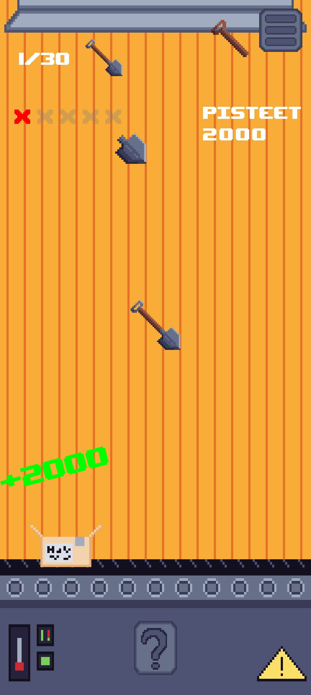

# 🏭 FactorAI

**FactorAI** is a small factory-themed mobile game built in Unity, where players will use artificial intelligence to help restore an old, struggling factory back to life.

🎮 Gameplay revolves around a couple of mini-games inspired by factory tasks:

- Combine products in a merge-style mini-game
- Quickly grab the correct items before time runs out in a catch falling items mini-game
- With enough gained points from the mini-games, activate AI to "play" (skip) the mini-games for you, helping you rack up high scores and bring the factory back to full production.

---

## 🛠 Tech Stack

- **Game Engine**: Unity
- **Language**: C#

---

## 📌 Project Info

- Developed as a first-year university group project
- Built for a client [FairDatAct](https://projects.tuni.fi/fairdatact/)
- The goal was to showcase in a fun and engaging way how artificial intelligence can help industrial fields’ productivity in the future

---

## ✨ Features

- **Merge mini-game**: Combine factory products in a merge game to score points
- **Catch mini-game**: Grab falling items before time runs out to keep the production line moving
- **High-score system**: Compete to bring the factory back to life with the highest points
- **Localization**: The game is fully localized to both English and Finnish

---

## 📸 Screenshots

    
    
    
    

---

## 🎥 FactorAI trailer

    

## 🌐 Website

Check out the **FactorAI** website for additional information: [https://webpages.tuni.fi/23tiko2c/](https://webpages.tuni.fi/23tiko2c/)
